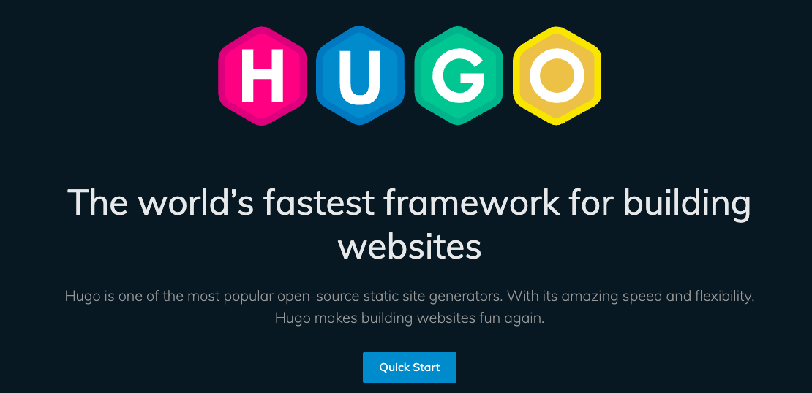
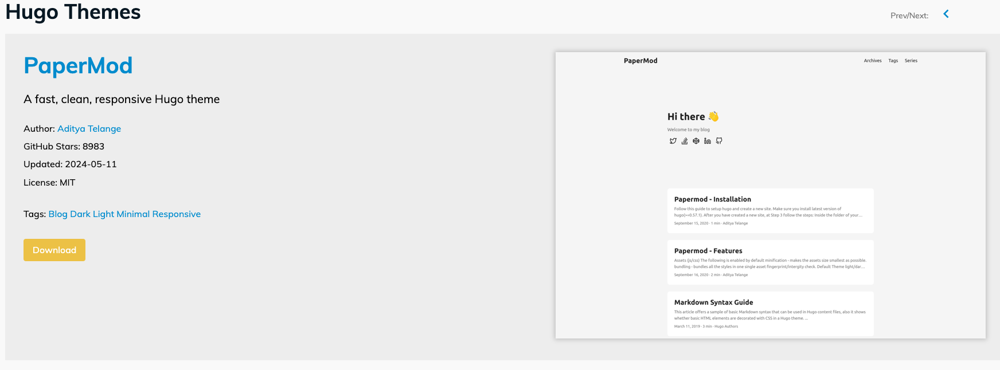
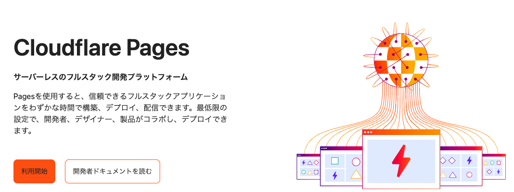

## 前提・条件

アウトプットの練習場として本ブログを作成しました（もうちょっと詳しい背景は[こちら]()）。
以下の基準で技術選定しました。

- 学習コストが小さく、リリースまで早く実現できること
- カスタマイズ性はあまり重視しない
- 日々の投稿の手間が最小になること
- 極力コストを抑えられること

## 使用した技術

| 項目 | 技術 |
| --- | --- |
|静的サイトジェネレーター| Hugo |
|ホスト先| Cloudflare Pages |
|CI/CD| Cloudflare Pages 付属のもの |

## Hugoについて

### Hugoとは？

go-lang製の静的サイトジェネレーター([公式ドキュメント](https://gohugo.io/))

以下のような特徴があります

- ビルドが高速
- ビルトインのテンプレートが多彩な機能を提供していること
- Markdownを基調として平易な文法でありながら、ショートコード等を用いた柔軟な拡張性を有していること

### なぜHugo?

先述の通り、学習コストが低く、リリースまでの時間を短縮できることが条件でした。
正直、DocusaurusやGatsbyなど他の静的サイトジェネレーターもその要件は満たしている気がします。

その中でも特にHugoを選定した点としては以下の通りでした。

- 特に学習コストが低いと感じた（DocusaurusやGatsby, VuePressなどは多少ReactやVueの知識がいる）
- ビルドが高速だった
- themeを見ていて、ブログ用と以外でも今後活用できそうと感じた（ドキュメント記述など）
- 過去に使ったことがある（ぶっちゃけこれが一番）

### Hugoのthemeについて

Hugoの公式ドキュメントにおける[theme紹介ページ](https://themes.gohugo.io/)は、ぱっと見の一覧性は高いものの、どういう順番で並んでいるのかどういうカテゴライズされているのか少し分かりずらいです。

そこで、GitHubにおいて「hugo-theme」のトピックを上からStarの多い順でソートして、上から順番に試してみました。
特にDemoサイトが公開されているものはちょっと触って感じを掴むのにいいですね。
https://github.com/topics/hugo-theme

結局、[PaperMod](https://github.com/adityatelange/hugo-PaperMod)というテーマが一番スターも多く使いやすそうだったのでこちらで選定しました。

## Cloudflare Pagesについて

### Cloudflare Pagesとは？

[公式ドキュメント](https://www.cloudflare.com/ja-jp/developer-platform/pages/)によると

> サーバーレスのフルスタック開発プラットフォーム
Pagesを使用すると、信頼できるフルスタックアプリケーションをわずかな時間で構築、デプロイ、配信できます。

とのこと。

触ってみた感じ以下のような特徴がありました。

- とりあえず動かすまでの学習コストが僅少
- 各種分析やCDなどの設定がほとんどついてる
- ドメイン管理やWAFなど、Cloudflareの他のコンポーネントとの組み合わせも楽

### リリースまで

1. Cloudflare PagesにApplicationを作成
2. Github Repositoryを選択(事前に連携しておく)
3. hugoを選択
4. localからpushする

という簡単な4ステップでCI/CDまで備えたアプリケーションが実現できました。

### カスタムドメインについて

私はムームードメインで独自ドメインを取っていました。
事前にムームードメイン側のネームサーバーを書き換えて、Cloudflareにドメインを移譲しておきます。
あとは、Cloudflare Pagesの設定ページから簡単に設定ができました。

### 画像について

画像については、当面はgit管理をして、ローカルからのリンクにしていきます。
こうすることで画像も併せてバージョン管理できるメリットがあります。
容量が問題になってきたら上手いことクラウドストレージに移動したいですが、それくらいたくさんのブログを書ければ御の字ですね。

### 没にした案について

ホスティングサービス隆盛の時代ということもあり、サーバーレスで手間のかからない選択肢がいくつもあり、色々悩みました。
以下は、没にした案です。

#### AWS

AWS上でもRoute53 + CloudFront + S3を用いて同様の構成が可能と考えます。
しかし、CI/CDの設定やプレビューページの作成、アクセス解析などどうしても自前で実装する必要がありそうです。
もしかしたら、Amplify Hostingなどでうまくいく？とも思いましたが、時間が足りず調べきれていません。

### Netlify

[Hugoを公式にサポートしている](https://docs.netlify.com/frameworks/hugo/)ためCloudflare Pagesと同等かそれ以上に簡単にセットアップが可能な印象を受けました。
今回、没にしたのは単純に興味の問題です。今後の仕事の中でCloudflareを使用する機会の方が多そうなため、Netlifyの使用は見送りました。

## 最後に

そんなこんなでとりあえずブログのリリースと第一稿まで漕ぎ着けました。
今後もある程度のペースで更新していけたらなと思います。