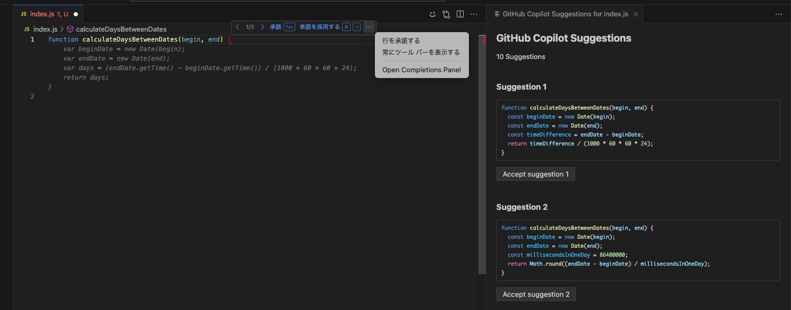
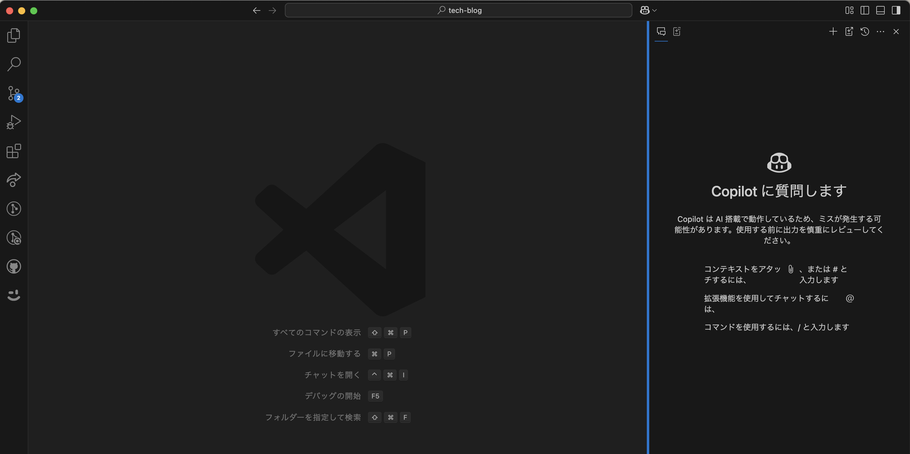

# はじめに

筆者はSIを生業とする企業で働いています。
お客様は比較的大きくて古い体質の企業様が多いです。
生成AI隆盛の現在ですが、予期せぬ学習されてしまうことを懸念して、あまり生成AIツールの導入に積極的ではありません。

そんな中でもGitHub CopilotはGitHub社の出しているサービスなので社内稟議も通りやすいらしく、使用が許可されています。
実際には他にも試してみたいツールはありますが、まずは職場で使えるツールに習熟しようということで、GitHub Copilotのドキュメントをローラーすることにしました。

# 今回の対象

- [GitHub Copilotのドキュメント](https://docs.github.com/ja/copilot)
    - GitHub Copilot全体の説明
    - 使い方だけでなく、管理者としての設定もある
- [Visual Studio Codeのドキュメント](https://code.visualstudio.com/docs/copilot/overview)
    - 主に使用者としてのドキュメント

筆者のOrgでは許可されていない機能も多いため、以下の主要な機能に絞って書いていきます。

- 対象
    - Chat
    - Inline Chat
    - Edits
    - Completion
- 目線
    - 開発者としてGitHub Copilotを使うこと
    - 管理者の目線ではない

# 知らなかったこと

## Completionの使い方

私の普段の使い方としては以下の2つでした
- コードの書き出しを書いて、提案がいい感じだったらTabを押す
- コメントに要件を書いて、提案がいい感じだったらTabを押す

[公式ドキュメント](https://docs.github.com/ja/copilot/using-github-copilot/getting-code-suggestions-in-your-ide-with-github-copilot)を読むともう少し奥深い使い方がありました。

- `⌘ + ->`で単語レベルの適用ができる
- Completion Panelを開くことで複数案の列挙ができる（画像の右側のペイン）

## モデルの話

[公式ドキュメント](https://docs.github.com/ja/copilot/using-github-copilot/asking-github-copilot-questions-in-your-ide#copilot-chat-%E3%81%AE-ai-%E3%83%A2%E3%83%87%E3%83%AB)によると、現在の既定のモデルはGPT 4oとのことでした。

また、以下のモデルへの変更も可能です
- Claude 3.5 Sonnet 
- o1
- o1-mini

CursorやらClineやらが色んなモデルを選択できるのに比べてやや見取りする感じもしますが、セキュリティを気にするエンタープライズな企業に対しては安心感のあるチョイスになっている気もします。

また、o1モデルについては推論時間が長くなることも注意書きされています。
[Copilotのベストプラクティス](https://docs.github.com/ja/copilot/using-github-copilot/best-practices-for-using-github-copilot)にもありますが、あくまでCopilotはコーディングの補助ツールなので、ライトなタスクをバッタバッタと倒していくことが想定されています。

そういう意味でも、回答の精度と生成時間を考慮して、4oが既定のモデルになっているのかなーと想像しました。

## コンテキストの話

### 全般的なコンテキストの話

LLMのモデルに対して回答の要求をする場合、Promptを通して適切なコンテキストを提供することが大切です。
余計なことを教えるとそれに回答が引っ張られるし、情報が足りないと明後日の方向に回答が飛んでしまいます。

[「Copilotを役立つ出力の導く」の項目](https://docs.github.com/ja/copilot/using-github-copilot/best-practices-for-using-github-copilot#copilot-%E3%82%92%E5%BD%B9%E7%AB%8B%E3%81%A4%E5%87%BA%E5%8A%9B%E3%81%AB%E5%B0%8E%E3%81%8F)を見ると、Copilotのコンテキストは以下のように決まるようです。

- Completionの場合
    - 開いているファイル
- Chat, Inline Chatの場合
    - 開いているファイル
    - 同一の会話の過去のやりとり
    - コンテキスト変数(`#file`, `@workspace`など)

そのため以下のようなことが推奨されています
- 関係ないファイルは閉じる
- Chat, Inline Chatは関係ない話題ならリレフッシュする
- コンテキスト変数で明示的にファイル等を指定する

### @workspaceの深掘り

「チャット参加者」という概念があるようです。和訳で変になっちゃってるパターンですね。
元々はエージェントという機能名だったようですが、昨今話題の自立型のエージェントと名前被りするのでこっちを変えたのかなと想像。

そういったチャット参加者の中でも@workspaceは重要な役割を果たします。
Chatの回答生成時に自動で挿入されていますよね。

https://code.visualstudio.com/docs/copilot/workspace-context にはそのメカニズムが詳しく載っていました。

広範な対象のコンテキストから、回答生成に際して関連性の高いものを発見します。
そこから、slashコマンドでブレの少ない指示を与えられるという趣旨のようです。

## Chatで使用できる変数・コマンド群まとめ

Promptを書く際の注意点として以下のようなものがあります。

> プロンプトを書く際には、意図（Intent）、コンテキスト（Context）、コンテンツ（Content）の3つの要素を意識しましょう。これらの要素を意識してプロンプトを書くことで、効果的に情報を整理し、AIに理解しやすい情報を提供できます。
> 服部 佑樹. コード×AIーソフトウェア開発者のための生成AI実践入門 (p.113). 株式会社技術評論社. Kindle 版. 

これらの要素を自然言語で十分に伝えるのは意外と骨が折れます。そこでGitHub Copilotでは数々の要素が用意されています。
- [Copilot Cheat Sheet](https://code.visualstudio.com/docs/copilot/copilot-vscode-features#_chat-with-github-copilot)
- [IDE で GitHub Copilot に質問する](https://docs.github.com/ja/copilot/using-github-copilot/asking-github-copilot-questions-in-your-ide)

### チャット参加者

| チャット参加者 | 説明 |
| --- | --- |
| `@workspace` | ワークスペース内のコードに関するコンテキストを保持している。項「@workspaceの深掘り」を参照 |
| `@vscode` | Visual Studio Code コマンドと機能に関するコンテキスト |
| `@terminal` | Visual Studio Codeターミナル シェルとその内容に関するコンテキスト |

### チャット変数

| 変数名 | 説明 |
| --- | --- |
| `#codebase` | 関連するワークスペースに関するコンテキスト |
| `#editor` | activeなエディターに関するコンテキスト |
| `#terminalSelection` | terminal上の選択箇所に関するコンテキスト |
| `#terminalLastCommand` | terminalで最後に実行したコマンドに関するコンテキスト |
| `#file`, `#<filename>` | 選択したファイルのコンテキスト。クイックピックで選択できる |
| `#sym`, `#<symbol>` | 選択したシンボルのコンテキスト。クイックピックで選択できる |

### スラッシュコマンド

| コマンド名 | 説明 |
| --- | --- |
| `/tests` | 選択された箇所のテストを生成 |
| `/explain` | コードの説明 |
| `/docs` | ドキュメントの生成 |
| `/fix`, `/fixTestFailure`, `/startDebugging` | デバッグやコード修正 |
| `/new` | プロジェクトのscaffoldができる |

この辺は「テストを書いて」とか自然言語でも同じような指示ができるのですが、ちょっと指示が複雑だったりするときにプロンプトの意図は「テストを書いて欲しいんだよ」ってのを明確に伝えられるってあたりが嬉しいポイントなのかなーと思います。

## コードレビュー機能

https://docs.github.com/ja/copilot/using-github-copilot/code-review/using-copilot-code-review
に記載があります。

コマンドパレット（Shift + Command + P）から「GitHub Copilot: レビューとコメント」を選択する。
機能を選択後、しばらくすると提案が入り、採用・不採用を決められます。

- vscode上で、選択した部分をレビューする
- vscode上 or GitHub Webサイト上で、差分をレビューする

といったオプションがあります。

筆者が手元で試した感じだと、順番に提案を採用していくと、動かないコードになってしまったり、不要な行が残ったりと少し残念なところがありました。
一方で、差分のレビューを定期的に受ければ変更範囲が十分に小さいはずなので、ちょっとしたミスは人間の目でカバーできそうです。
それよりもレビューを受けるサイクルが早くなるのは嬉しいですね。

カスタムなガイドラインも設定可能なようです。
- Enterprise限定（これ使いたいなー）
- https://docs.github.com/ja/copilot/using-github-copilot/code-review/configuring-coding-guidelines
- リポジトリごとに設定できる

## カスタムインストラクション機能

自然言語で記述した設定により、Copilotの一部の機能をカスタマイズすることができます。

対象は以下の通りです
- Chat
- Inline Chat
- Edits
- Completionは対象外（ここは残念）

設定方法は以下の2種類があります
- settings.jsonで設定
- `.github/copilot-instructions.md`で設定

いずれの場合も、設定項目をgit管理してチーム内共有などが可能ですね。

## コードベースのインデックス機能

@workspaceの説明でも触れられていますが、Copilotは回答の生成の際にプロンプトをそのままLLMに欠けているわけではないです。
関連する情報をセマンティック検索して、それらも組み合わせてコンテキスト情報を生成しています。

そこで、コードが検索にひっかかりやすいというのも重要な要素です。
例えば、以下のような工夫の余地があります。
- 明確で一貫性のある変数名
- 関数コメント

また、それだけでなく、リポジトリの内容でインデックスを貼っておこうというのが本機能です。
ドキュメントは以下
https://docs.github.com/ja/copilot/using-github-copilot/indexing-repositories-for-copilot-chat

具体的な方法がなぜか明示されていない...

こちらの記事が参考になります。
https://dev.classmethod.jp/articles/github-copilot-in-vs-code-workspace-index/

## Editsについて

### 全般

https://code.visualstudio.com/docs/copilot/copilot-edits

- 複数ファイルを編集することができる
- Working Setにファイルを追加して編集範囲を指定する
- Chatの内容をEditsに適用することができる

というあたりが気になりました。

### 制限いろいろ

https://code.visualstudio.com/docs/copilot/copilot-edits#_limitations

- Working Setは10個まで
- `@workspace /new`はChatで実施する
- `#codebase`よりもWorking Setで明示指定した方がいい

## ちょっとしたこと

### /clear

Chatの回答の精度を上げるために、会話のリフレッシュが有効とのことですが、そのためのコマンドがあります。
ショートカットは忘れてしまうのですが、`/clear`はTerminalとも似たような使い心地なので手に馴染みそうです。

### ペインをわけるとドラッグ&ドロップできた

`#file`変数を使って、ファイルをコンテキストに追加する際にデフォルトではドラッグアンドドロップがききません（おまかんかもですが）

以下のような感じで、Copilot Chatの拡張機能を右側のペインに移動したらうまく動作しました。

# 終わりに

GitHub CopilotおよびvscodeのGitHub Copilotのドキュメントをローラーで読んでみました。

GitHub Copilotはその名の通り、われわれ開発者の副操縦士であり、補助的な機能です。
昨今話題のcursorやDevinなどのエージェント系の生成AIツールと異なり、基本的な開発行為は我々が行います。

そういった特徴を理解すると、メモしてきた機能についても理解が深まるように感じました。

今後も日々の開発にしっかり活かしていきたいです。
