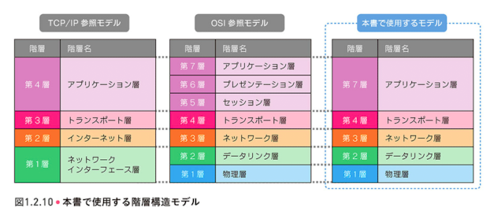

# 最初に

[バックエンドエンジニアロードマップ](https://roadmap.sh/backend) を見ていて、一番最初の「Internet」の項目からかなり不安があるなと兼ねてから問題意識を持っていた。

今回、以下の2つの書籍を通読したのでメモを残す


| 書籍名 | 著者名 | 出版年 | ISBN | 書籍ページ |
|--------|--------|--------|------|------------|
| 図解入門TCP/IP 第2版　仕組み・動作が見てわかる | みやた ひろし | 2024年12月25日 | 978-4-8156-2705-8 | [https://www.sbcr.jp/product/4815627058/](https://www.sbcr.jp/product/4815627058/) |
| 体験しながら学ぶ ネットワーク技術入門 | みやた ひろし | 2024年1月13日 | 978-4-8156-1859-9 | [https://www.sbcr.jp/product/4815618599/](https://www.sbcr.jp/product/4815618599/) |


# どれくらいネットワークがわかっているか

- 一応AWS認定のANSは一度取得したことがある
    - 完全にチート問題集の暗記しかしていない
    - 当時はTransitGatewayって答えておけば通るテストだった
- AWS上でVPCなんかをいじることがあった（ハンズオンレベル）
  - 本業はサーバーレス主体なので、非VPCリソースだった

# 読んでみてどうだったか

とても良かった。それぞれの書籍の特徴と学びについて紹介します。

## 『図解入門TCP/IP 第2版』の特徴

TCP/IPをベースにネットワークインターフェース層を物理層・データリンク層に分けて、順番通りにL1~L7まで各章で説明されています。




図解が多くわかりやすいのと、各章の構成が統一されているため理解しやすい構成になっていました。

* 各レイヤーのPDUフォーマットの説明
* 通信の順序の説明
* その他（高速化技術や補足など）

## 『体験しながら学ぶ ネットワーク技術入門』の特徴

この書籍は実践的なアプローチが特徴で、ubuntu上(WindowsならWSL2、Macならmultipass上に構築)にtinetというコンテナベースの仮想ネットワーク環境を整備し、実際にパケットをキャプチャして観察する内容です。

* 簡単な講義パート
* 実際に手を動かす体験
* より深い内容の解説

という流れで、各レイヤーごとに章を分けて説明されています。

『図解入門TCP/IP 第2版』との主な差分は以下の2点でした：
- 物理層のWi-Fiについての詳細な解説
- インターネット層のIPv6に関する実践的な内容

# 学んだこと

## AWSリソースの動作原理を想像できた

### Security GroupとL4のファイアウォール

[AWSドキュメント上でSecurity Groupの説明](https://docs.aws.amazon.com/ja_jp/vpc/latest/userguide/vpc-security-groups.html)を見ると、以下のような記述があります：

> セキュリティグループは、仮想ファイアウォールとして機能します。
> セキュリティグループはステートフルです。

これらについて以下のような疑問を長年感じていました：

1. FirewallというとWAF(Web Application Firewall)にも登場するが、2つはあまり関係なさそう
2. ステートフルインスペクションはどのように実現されているのか

『体験しながら学ぶ ネットワーク技術入門』で学んだことで、これらの疑問が解消されました：

* ファイアウォールは基本的にL3(ネットワーク層)やL4(トランスポート層)で動作し、IPアドレスやポート番号に基づいてパケットフィルタリングを行う
* WAFはL7(アプリケーション層)で動作し、HTTPリクエストの内容を検査する
* フィルターテーブルとコネクションテーブルにより、ステートフルインスペクションを実現している
    * 特にコネクションテーブルではリプライのパケットを予測して管理している（例: TCPハンドシェイクでSYNパケットを受け取ったら、次はSYN/ACKがくるはず）

実際にiptablesでステートフル/ステートレスの設定をして、その違いを確認できたのが理解の助けになりました：

```bash
# ステートフルな設定例
iptables -A INPUT -m state --state ESTABLISHED,RELATED -j ACCEPT
```

### ALBと負荷分散とSSL終端の話

ALBについても負荷分散とSSLオフロード機能があることはわかっていましたが、「なぜこれらが同じリソースで提供されるのか？」という疑問がありました。

本書を通じて：
* 両機能とも分散先のサーバーの負荷を低減するという同じ目的を持つこと
* SSLの暗号化/復号処理は計算コストが高く、これを集約して処理することで背後のサーバーリソースを効率的に使えること
* HAProxyの設定を通じて、実際にこれらの機能がどのように構成されるのかを理解できた


## トラブルシューティングの際のイメージが湧いた

「pingで疎通確認して」というのはよく聞きますが、それからどうするの？という疑問が解消されました。

- pingはL3でのICMPというプロトコルによる疎通確認を行なっていること
    - ICMPはRFCにより必ずIPとセットで実装されるべきと定められているので、結果IP通信の確認と同等の意味があること
- pingの疎通の可否でレイヤーを下方向へ調査するか、上方向へ調査するかが決められること


- 各レイヤーでのトラブルシュートのコマンド
    - L7: アプリケーション層
        - curl - Webサーバーへのリクエスト確認
        - dig, nslookup - DNSの名前解決確認
    - L4: トランスポート層
        - nc (netcat) - 特定ポートへの接続確認
        - ss - ソケット状態の確認
    - L3: ネットワークインターフェース層
        - ping - ICMPによる疎通確認
        - traceroute - パケットの経路確認
        - ifconfig/ip - ネットワークインターフェース設定確認
    - L2: データリンク層
        - arp - MACアドレス解決確認
        - tcpdump - パケットキャプチャ

この階層的なアプローチにより、問題の特定が体系的に行えることがわかりました。

## 今後の学習の指針が立った

主にサーバーレス構成のアプリケーションのバックエンドエンジニアとして仕事する場合には、以下のように学習の優先順位をつけるべきだと理解できました：

1. L7のプロトコル(DNS, HTTP1~3, SSL/TLSなど)に精通する必要がある
   - 特にDNSの仕組みはサーバーレス構成でも重要
   - HTTP/2, HTTP/3の最新プロトコルの特徴と利点
   - SSL/TLSの証明書管理と設定

2. L4以下については、トラブルシューティングができるレベルの理解が必要
   - 特にAWSのVPC関連設定とその影響
   - セキュリティグループとNACLの違いと使い分け

# さいごに

ネットワーク入門するのにあたり、掲題の2冊を同時にこなすのは最適だと感じました。図解による理論と実践的なハンズオンの両方から学ぶことで、より深い理解が得られます。

次のステップとしては以下を予定しています：
- DNSの仕組みについて深く学ぶ（『DNSがよくわかる教科書』を検討中）
- AWS上でのネットワーキング設計について実践的に学ぶ


## 参考リソース
- [図解入門TCP/IP 第2版　仕組み・動作が見てわかる](https://www.sbcr.jp/product/4815627058/)
- [体験しながら学ぶ ネットワーク技術入門](https://www.sbcr.jp/product/4815618599/)
