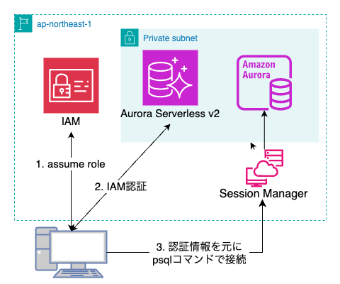

# はじめに

「サーバーレスエンジニアだけどAuroraに入門する」シリーズとして、IAM認証を試してみました。

一般的にRDBへの接続方法はユーザー名/パスワードを用いた静的な認証情報を用いる場合が多いと思います。（Auroraをマネコンから設定する場合も、IAM認証はアドオン扱い）
いくらAWS Secrets Manager等でローテーションを組んでいても、やはり扱いは慎重にするべきです。

せっかくAWSを使用しているので、IAM認証を試したいと思い、以下のドキュメント通り試してみました。
[公式ガイド](https://docs.aws.amazon.com/ja_jp/AmazonRDS/latest/AuroraUserGuide/UsingWithRDS.IAMDBAuth.html)


# やること

事前準備として、IAM認証をAuroraに設定する。
Auroraからトークンを取得し、そのトークンを用いてpsqlコマンドで接続を行う



# やってみた

## IAMユーザーまたはロールに以下の権限をアタッチ

```json
{
  "Version": "2012-10-17",
  "Statement": [
    {
      "Effect": "Allow",
      "Action": "rds-db:connect",
      "Resource": "arn:aws:rds-db:ap-northeast-1:123456789012:dbuser:db-ABCDEFGHIJKLMNOP/iam_user"
    }
  ]
}
```


## IAM認証の有効化

```bash
$ aws rds modify-db-cluster \
  --db-cluster-identifier xxxxxx-20250605 \
  --enable-iam-database-authentication \
  --apply-immediately
```

`--apply-immediately` は開発環境なのでつけてます。本番環境ではメンテナンスウィンドウ利用が推奨されます。


以下のコマンド結果が`true`になっていたら設定完了です。

```bash
$ aws rds describe-db-clusters \
  --db-cluster-identifier xxxxxx-20250605 \
  --query 'DBClusters[0].IAMDatabaseAuthenticationEnabled'
```


## PostgreSQLに入って以下のクエリを実行

```sql
CREATE USER iam_user WITH LOGIN;
GRANT rds_iam TO iam_user;
```

## トークン取得

```bash
$ aws rds generate-db-auth-token \
  --hostname xxxxxx.cluster-xxxxxxxxxxxx.ap-northeast-1.rds.amazonaws.com \
  --port 5432 \
  --region ap-northeast-1 \
  --username iam_user
```

こんな感じのが返ってくる

```text
xxxxxxx.cluster-xxxxx.ap-northeast-1.rds.amazonaws.com:5432/?Action=connect&DBUser=iam_user&X-Amz-Algorithm=AWS4-HMAC-SHA256&X-Amz-Credential=XXXXX%2F20250606%2Fap-northeast-1%2Frds-db%2Faws4_request&X-Amz-Date=20250606T035106Z&X-Amz-Expires=900&X-Amz-SignedHeaders=host&X-Amz-Security-Token=XXXXX&X-Amz-Signature=xxxxx
```

## PostgreSQLにアクセスする

```bash
export PGPASSWORD=$(aws rds generate-db-auth-token \
    --hostname ${HOST} --port 5432 --region ap-northeast-1 --username iam_user)
$ psql "host=localhost port=5432 user=iam_user dbname=mydb sslmode=require"
```

パスワード入力を求められるので、前の手順で取得したトークンを入力する.


ローカルPCからアクセスする場合は、[ポートフォワーディング等](https://kohski.dev/tech/prisma-migration-to-aurora/)を行う


# 注意点

## 制限事項

- IAM認証は200接続/秒でスロットリングされます
- トークンの有効期限は15分です

ということで、ECSやLambdaなどからアクセスする場合は、処理の最初にトークンを取得したり、定期的にトークンを取得しなおしたりするなどの作り込みが必要そうです。

## ユーザー作成をCI/CDやIaCでどう実現するか

- init.sqlを実現する単発のタスクをECSで作成する
- prisma migrateに含める
- CDKのカスタムリソース

などの方法で実現できそうです（未検証）

# 最後に

接続文字列を静的に扱うよりもずっと安心感のある認証方法だと思いました。
アプリケーションへの作り込みは後々試してみたいと思います。