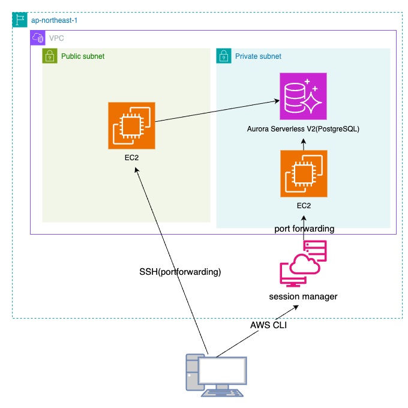
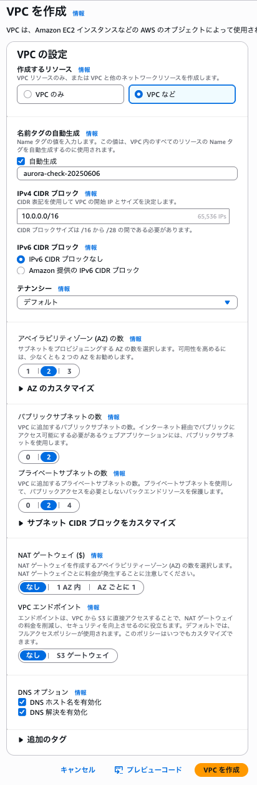
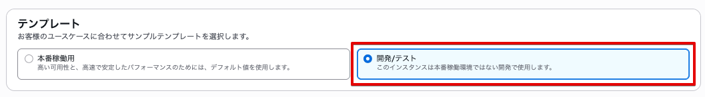
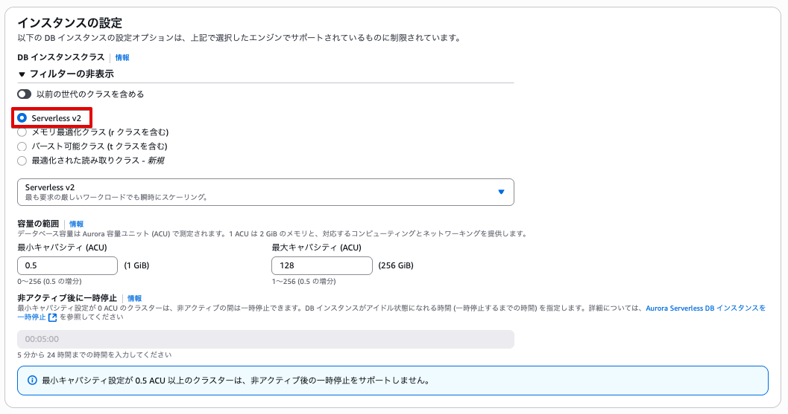
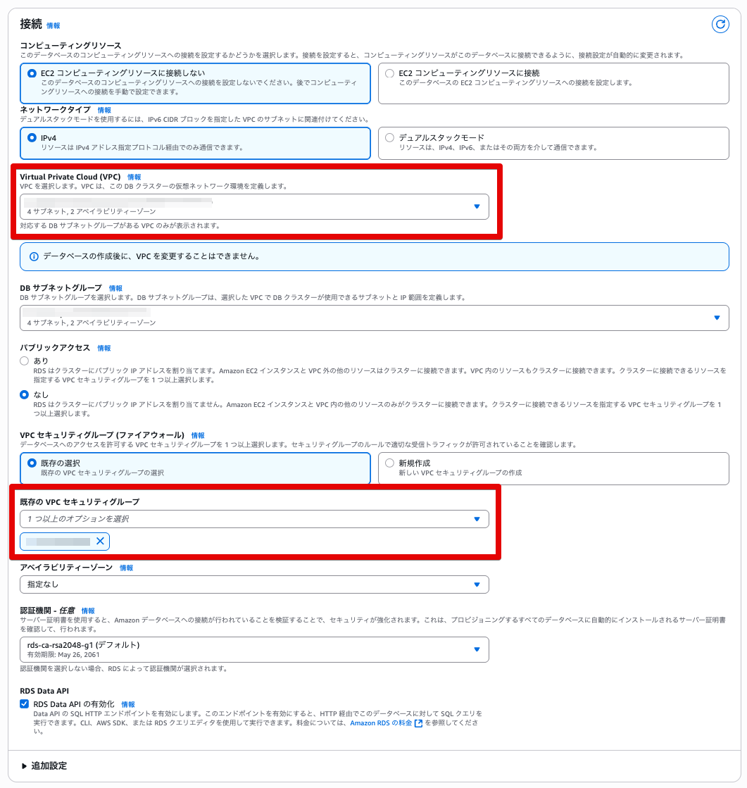
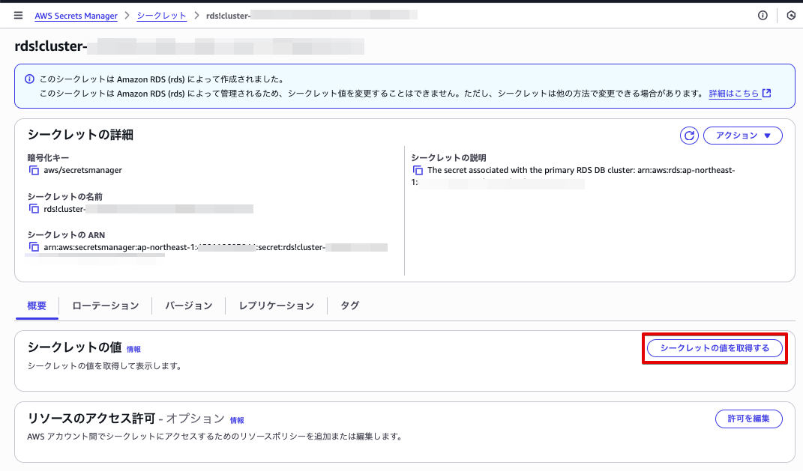

# はじめに

## 動機

[Amazon Aurora DSQL](https://aws.amazon.com/jp/rds/aurora/dsql/)のGAにより、待望のVPCレスなRDBがついにAWSにもリリースされました。
一方で、FK制約やSEQUENCEオブジェクトが使えないなど、まだまだ従来のAuroraから完全に移行されることはないのかなーと思っています。

私はエンジニアとしてのデビュー以来、一貫してAWS上でサーバーレス構成のアプリケーションを構築してきました。
AWS上でのサーバーレスの一つの側面として、VPC不要なサービスを繋ぎ合わせて構築するという特徴があります。
そのため、個人的にはVPCが大の苦手です。

踏み台サーバー経由でPrivate Subnet内のリソースにアクセスするという、ごくありふれたことをやったことないです。
今回はその辺の苦手克服のためにAurora Serverless V2のクラスターに対して、ローカルのMacから接続を試みたいと思います。

## やること



※ 複数AZに跨った構成になっていることは省略

2パターン試してみました。

1. public subnetに配置したEC2(以下、public EC2)を踏み台にして、SSH(ポートフォワーディング)をする
2. private subnetに配置したEC2(以下、private EC2)踏み台にして、session managerからポートフォワーディングをする

## バージョン等

| ツール | バージョン |
|--------|------------|
| macOS | 14.1 |
| AWS CLI | 2.15.53 |
| PostgreSQL | 14.18 (Homebrew) |

# 事前準備

## VPCの作成

マネコンからサクッと作ります。
ほとんどデフォルトで、VPCエンドポイント(S3ゲートウェイ)だけは「なし」に変更します



## Security Groupの作成

以下の3つのSecurity Groupを作成します。

### Aurora用Security Group

| タイプ | プロトコル | ポート範囲 | ソース | 説明 |
|--------|------------|------------|--------|------|
| PostgreSQL | TCP | 5432 | EC2用Security Group | Auroraへの接続用 |
| カスタムTCP | TCP | 5432 | 10.0.0.0/16 | VPC内からの接続用 |

### EC2用Security Group

| タイプ | プロトコル | ポート範囲 | ソース | 説明 |
|--------|------------|------------|--------|------|
| SSH | TCP | 22 | <自宅IPアドレス>/32 | 踏み台サーバーへのSSH接続用 |


### VPC エンドポイント用のSecurity Group

| タイプ | プロトコル | ポート範囲 | ソース | 説明 |
|--------|------------|------------|--------|------|
| HTTPS | TCP | 443 | EC2用Security Group | private EC2とSSMの通信用 |

Private EC2にローカルPCから接続する際に、後述するSession Manager(SSMの一機能)を使用します。
EC2の起動時にVPC外にあるSSMと通信をすることが必要になるのでこちらのSecurity Groupを作成します。

## VPCエンドポイントの作成

Private Subnet内のEC2からSession Managerを使用するために、以下の3つのVPCエンドポイントを作成します。

| サービス名 | 説明 |
|------------|------|
| com.amazonaws.ap-northeast-1.ssm | Systems Managerのメインサービス用 |
| com.amazonaws.ap-northeast-1.ec2messages | EC2インスタンスとSystems Manager間のメッセージング用 |
| com.amazonaws.ap-northeast-1.ssmmessages | Session Managerの通信用 |

これらのエンドポイントは、Private Subnet内のEC2がインターネットを経由せずにSession Managerと通信するために必要です。
各エンドポイントは、先ほど作成したVPCエンドポイント用のSecurity Groupをアタッチします。

## Aurora Serverless V2のクラスターを作成

デフォルトから変更したり、注意事項だけ抜粋します


「開発/テスト」を選択


「Serverless v2」を選択


作成済みのVPCとSecurity Groupを選択する


## 踏み台EC2を作成

以下の2つのEC2インスタンスを作成します：

- public EC2
  - 配置: public subnet
  - パブリックIP: 自動割り当てを有効化
  - 用途: 直接SSH接続によるポートフォワーディング

- private EC2
  - 配置: private subnet
  - パブリックIP: 割り当てなし
  - 用途: Session Manager経由でのポートフォワーディング

## Secret Managerからパスワードを取得

Secret Managerへ移動し、該当のシークレットを選択し、「シークレットの値を取得する」を押下



# アクセスしてみる

## public EC2からアクセス

### ポートフォワーディングの設定

```
ssh -i ~/Downloads/kohski-indivisual.pem \
    -L 5432:<Auroraクラスターのライターエンドポイント>:5432 \
    ec2-user@<EC2のパブリックIP>
```

`-L`オプションがポイントで、以下のような動作をします：

```
ローカルマシン:5432 -> EC2:5432 -> Aurora:5432
```

具体的には：

1. ローカルマシンの5432ポートへの接続を
2. SSHトンネル経由でEC2に転送し
3. EC2からAuroraの5432ポートに接続する

この仕組みにより、ローカルマシンからは`localhost:5432`に接続するだけで、Auroraにアクセスすることができます。

### ローカルPCからデータベースへの接続

ポートフォワーディングを設定した状態で、別のターミナルウィンドウを開き、以下のコマンドを実行します：

```
psql -h localhost -U postgres
```

注意点：
- ホスト名は必ず`localhost`を指定します
- ポート番号はデフォルトの5432を使用します
- ユーザー名とパスワードはAuroraの設定に合わせて指定します

接続が成功すると、PostgreSQLのプロンプトが表示されます。

## private EC2からアクセス

### session-manager経由でポートフォワーディング設定する

```
aws ssm start-session --target i-093933295cbd1e239 \                                                           ✘ 255 05:46:24
  --document-name AWS-StartPortForwardingSessionToRemoteHost \
  --parameters '{"host":["database-20250605.cluster-c3g6ekuak3h1.ap-northeast-1.rds.amazonaws.com"],"portNumber":["5432"], "localPortNumber":["5432"]}'
```

### ローカルPCからデータベースへの接続

```
psql -h localhost -U postgres
```

接続できました！


# 考察

## セキュリティを考慮するとprivate EC2 + session manager

しっかりIP制限をかけたとしても、EC2をpublic subnetに配置することは気が引けますね。
個人的な開発用途を除いて、private EC2 + Session managerの方がセキュリティ上良いかなと思いました。

## NAT GW vs VPC Endpoint

Private subnet上のEC2とSSMの通信のためにVPC Endpointを3つとそれに付随するSecurity Groupを作成しました。
session managerを使いたいというシンプルな目的のためにリソースをいくつも作るのは若干気が引けます。

private subnetからインターネットへ出るにはNAT Gatewayを使用するのも一つの手段です。
ただし、基本的には料金が高いものという認識がありました。

| サービス | 固定料金 | 通信料金 |
|----------|----------|----------|
| NAT Gateway | 0.062 USD/時/個 | 0.062 USD/GB |
| VPC Endpoint | 0.014 USD/時/個 | 0.01 USD/GB (最初の1PB) |

いずれも固定料金部分で、0.062 * 30 = 1.86 USD ≒ 300円
開発用途なら、そんなに気にしないでいい料金感と感じました。

# 最後に

世は大AI時代ですが、アプリケーションよりもずっと硬直的なデータのマネジメントはまだまだ人の手が必要です。
いったん繋いでみるということができるようになったので、今後の実務に活かしていきたいです。

検証の過程で気になったので、以下も試してみようと思います。

- IAM認証
- Data API
