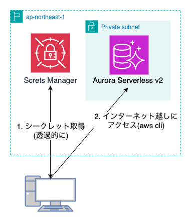

# はじめに

「サーバーレスエンジニアだけど Aurora に入門する」シリーズとして、Data API を試してみました。
[Amazon RDS Data API の使用](https://docs.aws.amazon.com/ja_jp/AmazonRDS/latest/AuroraUserGuide/data-api.html)

## なぜ Data API を使うの？

RDB への接続は一般的に TLS 上で独自のプロトコルで実行されます。
Amazon RDS においては、Private Subnet 内に何かしらのコンピューティングリソースを作成して、接続文字列を腹持ちしてコネクションを張るのがセオリーです。

これらの手順はけっこう煩雑です。
Amazon RDS においては、HTTP エンドポイントに対してアクセスできる Data API という機能があります。

この接続方式を利用することで、VPC 外のリソースからも安全かつ簡単に DB へのアクセスが可能となります。

# やること



# やってみた

## 設定の確認

- Data API が有効になっていること
  以下が true になっていることを確認
  ```
  aws rds describe-db-clusters \
  --db-cluster-identifier {クラスター識別子} \
  --query 'DBClusters[0].HttpEndpointEnabled' \
  --region {リージョン}
  ```
- シークレット情報は Secrets Manager で管理されていること
- IAM ロールに RDS と Secrets Manager への参照権限がついていること

## ローカルの Mac から接続

### CLI コマンド

```bash
$ aws --region ap-northeast-1 \
    --output json \
    --endpoint-url https://rds-data.ap-northeast-1.amazonaws.com \
    rds-data execute-statement \
    --resource-arn '{AuroraクラスターのARN}' \
    --secret-arn '{SecretsのARN}' \
    --database mydb \
    --sql "SELECT now();"
```

### TypeScript

```typescript
import {
  RDSDataClient,
  ExecuteStatementCommand,
} from "@aws-sdk/client-rds-data";

const client = new RDSDataClient({ region: "ap-northeast-1" });

const main = async () => {
  const command = new ExecuteStatementCommand({
    resourceArn:
      "arn:aws:rds:ap-northeast-1:xxxxxxxxxxxx:cluster:database-xxxxx",
    secretArn:
      "arn:aws:secretsmanager:ap-northeast-1:xxxxxxxxxxxx:secret:rds!cluster-xxxxx",
    sql: "SELECT * FROM users",
    database: "mydb",
  });
  const result = await client.send(command);
  return result;
};

main().then((res) => console.log(JSON.stringify(res, null, 2)));
```

### レスポンス例

以下のような感じです。

- 列名が含まれない
- 各値が { stringValue: "..." } のようにネストされていて、直接扱えない

という感じで活用するには一工夫必要そうです（これは今後の課題）

```json
{
  "$metadata": {
    "httpStatusCode": 200,
    "requestId": "c756950a-6574-4663-9348-1d9acd50d150",
    "attempts": 1,
    "totalRetryDelay": 0
  },
  "numberOfRecordsUpdated": 0,
  "records": [
    [
      {
        "longValue": 1
      },
      {
        "stringValue": "テストユーザー"
      },
      {
        "stringValue": "sample@example.com"
      },
      {
        "stringValue": "2025-06-06 22:47:49.528"
      },
      {
        "stringValue": "2025-06-06 22:47:49.528"
      }
    ]
  ]
}
```

# 注意事項

## 制限事項が多い

意外と意識すべき制限事項が多いです
[公式ドキュメント](https://docs.aws.amazon.com/ja_jp/AmazonRDS/latest/AuroraUserGuide/data-api.limitations.html)

- リクエスト制限
  - 32KB
- レスポンス制限
  - 64KB/行
  - 1MiB/リクエスト
- リクエストはライターインスタンスだけに向かう

## レイテンシーの問題

ドキュメントからの類推も含みますが、Data API は直接接続に比べて以下の工程が発生するのでレインテンシーは増えることが類推されます。

- TLS ハンドシェイク
- IAM 認証
- Secrets Manager からのシクレット取得
- レスんポンスの JSON への加工

## どういう時使える？

以上の制限事項を考慮すると、あまり低レイテンシーが求められない & 小規模なシステムに向いているのかなーと思いました。
また、リクエスト・レスポンスのペイロード周りは制限が厳しいので、しっかりとした設計が必要だなと感じました。

# 最後に

VPC 外からも SDK や CLI を通して、簡単にアクセスできました。

2025 年 6 月８日現在、[Data API は prisma がサポートしていない](https://github.com/prisma/prisma/issues/1964)こともあり少し影が薄い印象です（ちなみに、Drizzle はサポートしています。[公式ドキュメント](https://orm.drizzle.team/docs/connect-aws-data-api-pg)）

しかし、VPC 外のコンピューティングリソースから簡単にアクセスできるのはぐっと開発工程が軽くなるので、とてもいいなと思いました。
